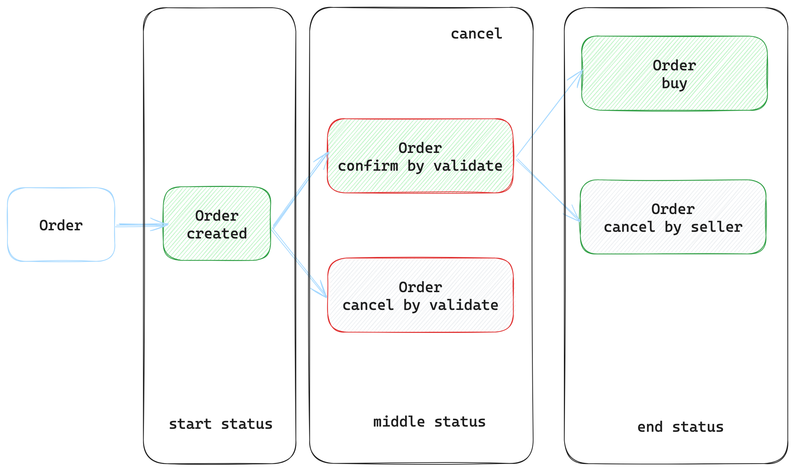

# Market Place

## How to intergate market place
```
MarketPlace = { git = "xxx", rev = "xxx" }
```

## Order status


Users have the ability to list, cancel, and buy orders.

The individual who list an order becomes the Seller. A Seller cannot buy their own order and can only cancel orders they have created.

Orders highlighted with a red frame are managed by a validator, and thus, cannot be modified by users. User must wait validator process(confirm or cancel) orders.

Once an order is created by a Seller, it will remain in a pending status until the validator either cancels or confirms it. During this period, no further actions can be taken on the order.

## Functions

### 1. List Order

To place an order, users must first prepare a collection of this specific type.

### 1. create collection

```
public fun create_collection<QuoteCoin>(
    // config: Reference to the global configuration settings. It likely contains settings and parameters relevant to the entire system.
    config: &GlobalConfig,

    // p_config: Reference to another global configuration, possibly specific to a particular aspect or module of the system.
    p_config: &PGlobalConfig,

    // collections: Mutable reference to the collections object, where the new collection will be added or managed.
    collections: &mut Collections,

    // p: A string parameter, potentially representing a unique identifier or a name for the new collection.
    p: String,

    // tick: A string representing the ticker symbol or a short identifier for the new collection.
    tick: String,

    // clock: Reference to a Clock structure, which could be used for timestamping the creation of the collection or for other timing-related functionalities.
    clock: &Clock,

    // ctx: Mutable reference to the transaction context. This is likely used for managing the details and state of the collection creation within the transaction system.
    ctx: &mut TxContext,
)

```

### 2. create collection and list order

```
#[lint_allow(share_owned)]
public fun create_collection_and_list_order<QuoteCoin>(
    // config: Reference to the global configuration settings. This might contain system-wide settings and parameters.
    config: &GlobalConfig,

    // p_config: Reference to another global configuration, possibly for a specific module or aspect of the system.
    p_config: &PGlobalConfig,

    // collections: Mutable reference to the collections object. This is where the new collection will be added or managed.
    collections: &mut Collections,

    // user_indexer: Mutable reference to the user indexer, likely used for tracking user actions or statuses in the system.
    user_indexer: &mut UserIndexer,

    // p: A string parameter, possibly representing a unique identifier or name for the new collection.
    p: String,

    // tick: A string representing the ticker symbol or a short identifier, possibly for the new collection or order.
    tick: String,

    // amt: Represents the amount in the order, as a 64-bit unsigned integer.
    amt: u64,

    // extends_key: A vector of strings, which could be used for additional order metadata keys.
    extends_key: vector<String>,

    // extends_value: A vector of strings corresponding to the values for the metadata keys.
    extends_value: vector<String>,

    // price: The price of the order, as a 128-bit unsigned integer.
    price: u128,

    // expire_ts: A 64-bit unsigned integer representing the expiration timestamp of the order.
    expire_ts: u64,

    // clock: Reference to a Clock structure, likely used for timestamping or timing the transaction.
    clock: &Clock,

    // ctx: Mutable reference to the transaction context. This is used for managing the details and state of the transaction within the system.
    ctx: &mut TxContext,
)

```

### 3. list order
```

public fun list_order<QuoteCoin>(
    // config: Reference to the global configuration settings.
    config: &GlobalConfig,

    // collection: Mutable reference to the collection of QuoteCoins.
    collection: &mut Collection<QuoteCoin>,

    // p: A string parameter (purpose unspecified).
    p: String,

    // tick: A string representing the ticker symbol for the order.
    tick: String,

    // amt: Represents the amount in the order, as a 64-bit unsigned integer.
    amt: u64,

    // extends_key: A vector of strings, possibly for additional order metadata keys.
    extends_key: vector<String>,

    // extends_value: A vector of strings corresponding to the values for the metadata keys.
    extends_value: vector<String>,

    // price: The price of the order, as a 128-bit unsigned integer.
    price: u128,

    // expire_ts: A 64-bit unsigned integer representing the expiration timestamp of the order.
    expire_ts: u64,

    // user_indexer: Mutable reference to the user indexer.
    user_indexer: &mut UserIndexer,

    // clock: Reference to a Clock structure, likely for timestamping or scheduling.
    clock: &Clock,

    // ctx: Mutable reference to the transaction context.
    ctx: &mut TxContext,
)


```

### 2. Buy Order
Sellers are prohibited from buying their own orders.

```
public fun buy<QuoteCoin>(
    // config: Mutable reference to the global configuration settings.
    config: &mut GlobalConfig,

    // user_indexer: Mutable reference to the user indexer, possibly for tracking user actions or statuses.
    user_indexer: &mut UserIndexer,

    // collection: Mutable reference to the collection of QuoteCoins.
    collection: &mut Collection<QuoteCoin>,

    // order: Mutable reference to the specific order being purchased.
    order: &mut Order<QuoteCoin>,

    // pay_coin: The Coin of QuoteCoin type that is used for payment in the transaction.
    pay_coin: Coin<QuoteCoin>,

    // clock: Reference to a Clock structure, likely used for timestamping or timing the transaction.
    clock: &Clock,

    // ctx: Mutable reference to the transaction context, for managing the details and state of the transaction.
    ctx: &mut TxContext,
)

```

### 3. Cancel Order by Seller
Sellers have the ability to cancel only those orders that they have confirmed themselves.

```
public fun cancel_order_by_seller<QuoteCoin>(
    // config: Reference to the global configuration settings. This could be used to access overall system or market settings.
    config: &GlobalConfig,

    // collection: Mutable reference to the collection of QuoteCoins. This may be used to modify or update the collection based on the order cancellation.
    collection: &mut Collection<QuoteCoin>,

    // order: Mutable reference to the specific order being cancelled. This is the main subject of the function, allowing changes to the order's status or details.
    order: &mut Order<QuoteCoin>,

    // clock: Reference to a Clock structure, likely used for timestamping the cancellation event or for record-keeping purposes.
    clock: &Clock,

    // ctx: Mutable reference to the transaction context. This parameter might be used to manage and track the state of the transaction, ensuring proper handling of the cancellation within the system.
    ctx: &mut TxContext,
)

```

##  Query Functions

### 1. fetch confirmed orders
```
// The fetch_confirmed_orders function retrieves a list of confirmed orders based on specified criteria.
// The results are emitted as an event, which can be parsed through an SDK to obtain the fetched data.
public fun fetch_confirmed_orders<QuoteCoin>(
    // collection: A reference to the collection of QuoteCoin. It likely contains data structures to manage and index orders.
    collection: &Collection<QuoteCoin>,

    // price_cursor: A 128-bit unsigned integer used as a cursor for the price. It helps in navigating through the orders based on their price.
    price_cursor: u128,

    // order_cursor: A vector of IDs used as a cursor for specific orders. This allows the function to start fetching from a particular point in the order list.
    order_cursor: vector<ID>,

    // limit: A 64-bit unsigned integer that sets the maximum number of orders to fetch.
    limit: u64
)
```

### 2. fetch user order

```
// The fetch_user_orders function retrieves a list of order IDs associated with a given seller and buyer.
// The results are emitted as an event, which can then be parsed through an SDK to obtain the fetched order IDs.
public fun fetch_user_orders(
    // user_indexer: A reference to the UserIndexer, likely a data structure that indexes user-related information, including their orders.
    user_indexer: &UserIndexer,

    // seller: The address of the seller whose orders are to be fetched. This functions as the key to look up the seller's orders in the UserIndexer.
    seller: address,

    // order_cursor: A vector of IDs that functions as a cursor for the orders. This allows the function to start fetching from a specific point in the seller's order list.
    order_cursor: vector<ID>,

    // limit: A 64-bit unsigned integer that specifies the maximum number of order IDs to fetch.
    limit: u64
)
```